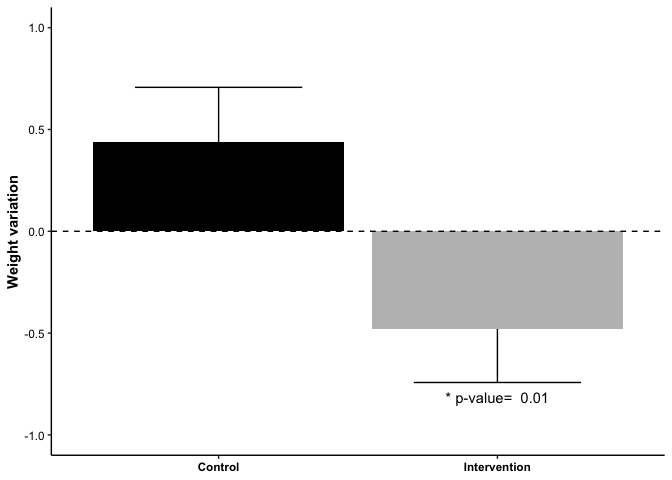
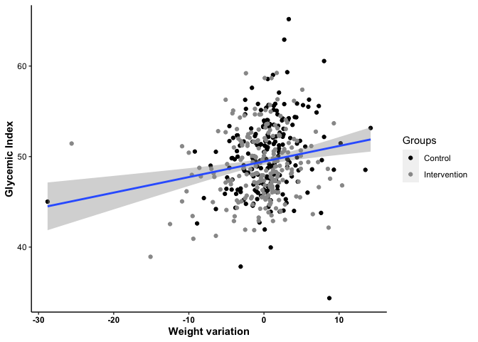

## Data analysis of: Preventing Weight Gain in Women in Rural Communities: A Cluster Randomised Controlled Trial. Lombard et al. (2016)

Data available at: <https://figshare.com/ndownloader/files/2600235>

Objective: Intent to treat: simple, low-intensity, self-management lifestyle intervention (HeLP-her) can prevent weight gain in young to middle-aged women

Primary outcome: weight gain at 1 year. Baseline and within-group differences over time were assessed using paired Student's t tests for continuous variables The effects of the intervention on study outcomes (between group differences) at 1 yr were analysed using linear regression with the variable of interest at 1 yr as the outcome variable, adjusted for baseline values, and obtained robust standard errors to adjust for the clustering effect of town in the regression models (the Huber/White/sandwich estimate of variance)

In the second step, analyses were performed on data that included values imputed using linear regression, multiple imputation with boot strapping.

### Sample size:

The study needed a sample size per group of 196 to demonstrate a 1 kg difference in weight gain with the intervention, considering a standard deviation of 3.5 and power of 80%. However, since the study analysis used 40 location clusters, with a variance inflation factor (VIF) of 1.28 and an intracluster correlation of 0.02, the sample needed was 600, because , which is equivalent to: 

### Summary of the intervention impact

<!-- -->

### Adjusted analysis

The linear model of the intervention impact adjusted by the initial BMI reveals an effect of 0.89kg, with a significant p-value of 0.0184. However, this model does not fit the data adequately. The residual standard error (RSE) is very high (4.157), while the R2 is very low, 0.021. One culprit behind this is that having a higher Glycemic Index is a more powerful predictor for weight loss than the intervention.

<!-- -->

Therefore, adjusting the linear model by the glycemic index removes the significant effect of the intervention on weight variation and improves the R2 from 0.021 to 0.048. While removing the intervention from the model almost does not affect the R2 (0.043).

<table class="table table-striped" style="font-size: 12px; margin-left: auto; margin-right: auto;">
<caption style="font-size: initial !important;">Weight variation adjusted by glycemic index</caption>
 <thead>
  <tr>
   <th style="text-align:left;"> term </th>
   <th style="text-align:right;"> estimate </th>
   <th style="text-align:right;"> std.error </th>
   <th style="text-align:right;"> p.value </th>
  </tr>
 </thead>
<tbody>
  <tr>
   <td style="text-align:left;"> (Intercept) </td>
   <td style="text-align:right;"> -6.8262816 </td>
   <td style="text-align:right;"> 2.6687611 </td>
   <td style="text-align:right;"> 0.0108883 </td>
  </tr>
  <tr>
   <td style="text-align:left;"> GlycemicIndex </td>
   <td style="text-align:right;"> 0.1828384 </td>
   <td style="text-align:right;"> 0.0508232 </td>
   <td style="text-align:right;"> 0.0003602 </td>
  </tr>
  <tr>
   <td style="text-align:left;"> groupIntervention </td>
   <td style="text-align:right;"> -0.6089168 </td>
   <td style="text-align:right;"> 0.4080232 </td>
   <td style="text-align:right;"> 0.1363687 </td>
  </tr>
  <tr>
   <td style="text-align:left;"> BMI_base </td>
   <td style="text-align:right;"> -0.0681589 </td>
   <td style="text-align:right;"> 0.0328567 </td>
   <td style="text-align:right;"> 0.0386582 </td>
  </tr>
</tbody>
</table>

<table class="table table-striped" style="font-size: 12px; margin-left: auto; margin-right: auto;">
<caption style="font-size: initial !important;">Weight variation adjusted by glycemic index without intervention</caption>
 <thead>
  <tr>
   <th style="text-align:left;"> term </th>
   <th style="text-align:right;"> estimate </th>
   <th style="text-align:right;"> std.error </th>
   <th style="text-align:right;"> p.value </th>
  </tr>
 </thead>
<tbody>
  <tr>
   <td style="text-align:left;"> (Intercept) </td>
   <td style="text-align:right;"> -7.5708538 </td>
   <td style="text-align:right;"> 2.6255922 </td>
   <td style="text-align:right;"> 0.0041382 </td>
  </tr>
  <tr>
   <td style="text-align:left;"> GlycemicIndex </td>
   <td style="text-align:right;"> 0.1933836 </td>
   <td style="text-align:right;"> 0.0504041 </td>
   <td style="text-align:right;"> 0.0001442 </td>
  </tr>
  <tr>
   <td style="text-align:left;"> BMI_base </td>
   <td style="text-align:right;"> -0.0714631 </td>
   <td style="text-align:right;"> 0.0328305 </td>
   <td style="text-align:right;"> 0.0300655 </td>
  </tr>
</tbody>
</table>

Therefore, adjusting the linear model by the glycemic index removes the significant effect of the intervention on weight variation and improves the R2 from 0.02 to 0.05. While removing the intervention from the model almost does not affect the R2 (0.043). Thus, the approach of using the glycemic index as a predictor for weight variation renders a better model than the one initially proposed by the study. But more importantly, this data analysis points out that rural women of Australia with higher glycemic index have a greater chance of losing weight, even if they are not more susceptible to the effects of self-management lifestyle intervention.

